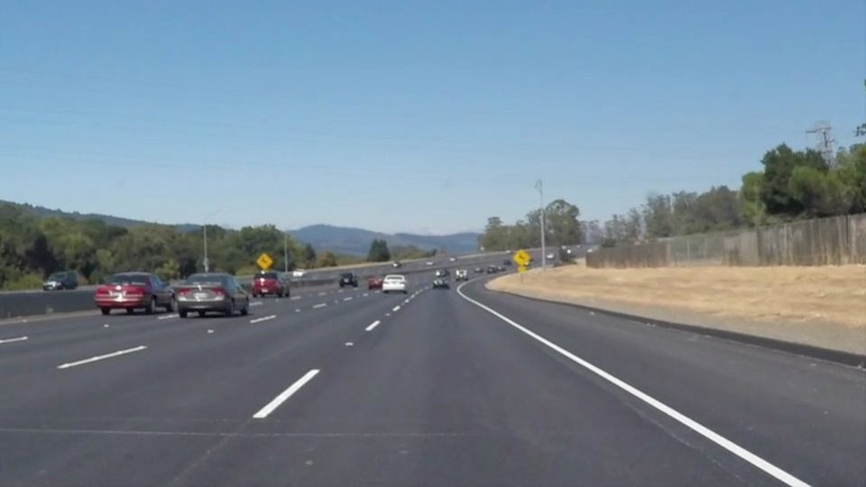
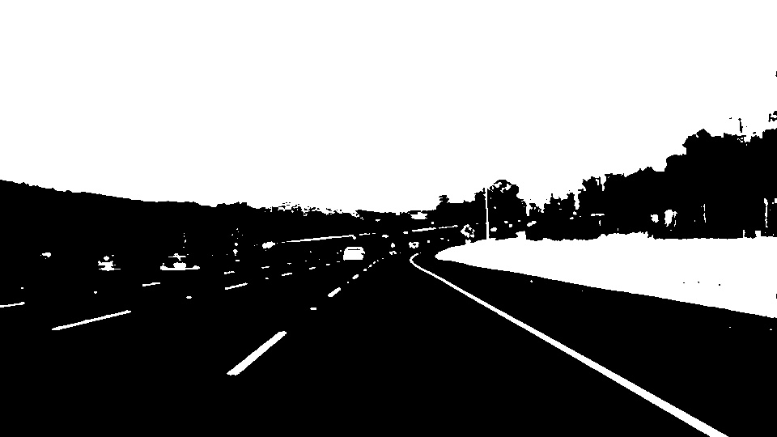
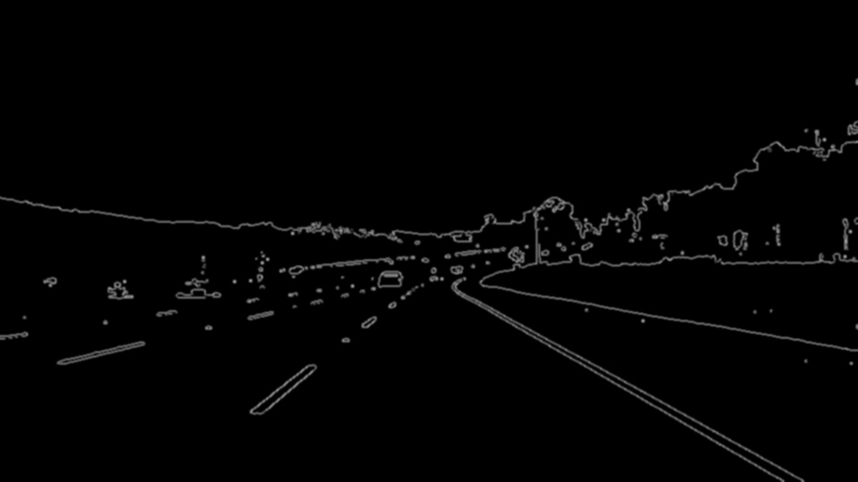
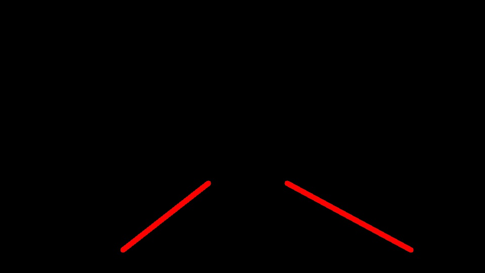
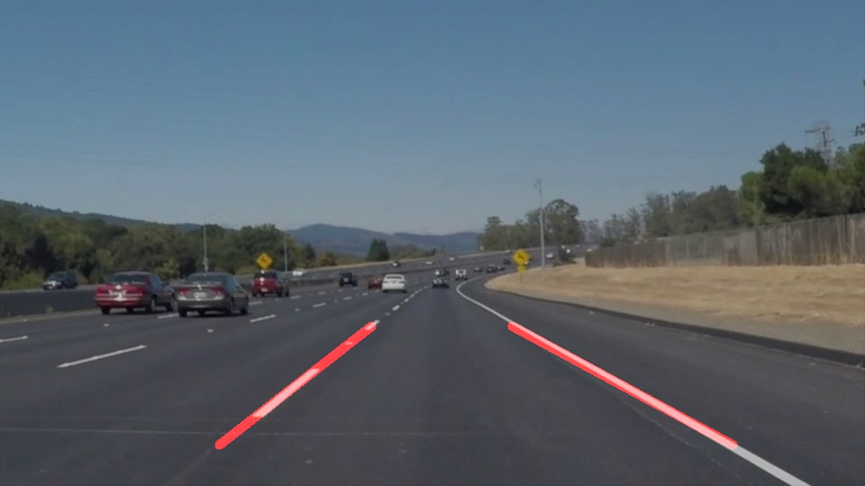

# **Finding Lane Lines on the Road** 

**Finding Lane Lines on the Road**

### Reflection

### 1. Describe your pipeline. As part of the description, explain how you modified the draw_lines() function.

The pipeline consists of 7 discrete steps.
1st Step :: Load the input image.

2nd Step :: Convert the input image to grayscale using grayscale()

3rd Step :: Convert the grayscale into canny edge detected image canny().

4th Step :: Take the ROI of the lane marking for processing using roi_image().

5th Step :: Apply gaussian blur to the image using gaussian_blur(). (Not required since Hough already applies it internally)

6th Step :: Perform Hough tranform on the processed image using hough_image().

7th Step :: Merge the Lane marked image and the input image using weighted_img().

### 2. Identify potential shortcomings with your current pipeline

1.The lane detection output has many jitters, its not smooth.
2.The thresholds for canny detection are manually fed in using trial and error, it should be dynamically calculated and fed in to make    the system more robust.
3.Cannot identify curved markings.
4.ROI selection is fixed, if the lanes go beyond the ROI region, the pipeline won't be able to detect the lanes
5.The pipeline will work for daylight conditions, but will not work for night conditions.

### 3. Suggest possible improvements to your pipeline
1. Completely remove usage of manual thresholding methods wherever possible, switch to dynamically updated thresholds based on input images.
2. Improve on the draw_lines function.
3. Identification of ROI regions based on Terrain
4. Detection of lighting conditions for an image, and adjusting threholds for the input image based on the lighting conditions.

